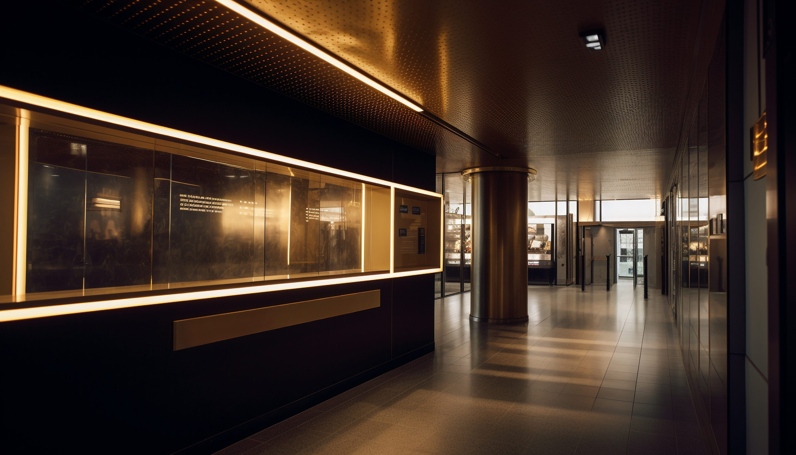

## 📦 Project Overview

A modern, responsive portfolio website built with **React** and **CSS**. This project showcases my recent works, services, and contact information as a frontend developer.

## 🚀 Live Demo

🔗 [View Live Site](https://isi-portfolio2.vercel.app/)

## 📌 Features

- ⚡ Fully responsive design
- 🎨 Clean and modern UI
- 🖼️ Image slider for projects
- 📜 Smooth scroll navigation
- 💡 Organized folder structure
- 💬 Contact section with info
- 🔄 Auto-sliding latest work section

## 🛠️ Tech Stack

- React.js
- Plain CSS
- Vite
- Git & GitHub
- Vercel (Deployment)

## 📁 Project Structure

```
Isi-Portfolio2/
│
├── public/                 # Static files
├── src/
│   ├── assets/             # Images & data files
│   ├── Components/         # Reusable components (Navbar, Hero, MyWork, etc.)
│   ├── App.jsx             # Root component
│   └── main.jsx            # React entry point
│
├── package.json
└── README.md
```

## 🧑‍💻 Author

**Okan Perpetual Isi**  
Frontend Developer  
📍 Lagos, Nigeria  
📧 perpetualokan0@gmail.com  
📞 +234-810-355-8837  

## 📸 Screenshots

| Homepage | Projects |
|----------|----------|
|  |  |

---

## 🧾 License

This project is open-source and available under the [MIT License](LICENSE).
